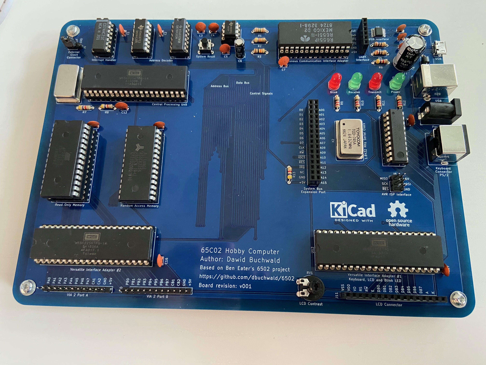

# What is this? Yet another 6502 project?!

Well, yes and no. There is no shortage of 6502-based projects out there, and there are excellent resources about this evergreen CPU. There are commercial initiatives, retro consoles, educational computers – and they are all great source of inspiration. That being said, when I ventured on another voyage of discovery inspired by [Ben Eater’s excellent videos](https://www.youtube.com/playlist?list=PLowKtXNTBypFbtuVMUVXNR0z1mu7dp7eH) I found myself lost on number of occasions. I had to overcome number of issues, and some of these have not been trivial to solve. I learned a lot, and I realised that not all of these things were documented well enough in other projects.

I should have probably started writing this journal long time ago, when most of the stuff I worked on was fresh, but as many before me, I didn’t want to get distracted by writing, and I wasn’t sure if the hobby is going to stick around for long enough to justify the effort. Now, after almost a year I know I’m addicted and I will keep going.

## What happened before

Before I move on with my project, I need to document the starting point. Almost a year ago I stumbled across first Ben Eater’s video in his 6502 series and it brought back ton of memories. As a kid I had Atari 800XE PC and it was my introduction into the world of programming. I loved this computer, I loved its simplicity, I loved how approachable it was. You just needed to type few lines of BASIC code to start drawing graphics, and for a kid it seemed as only one’s imagination could limit what the machine did.

Time has passed, new computers were introduced and I forgot about my old friend, until one day YouTube recommendation algorithm suggested I watch Ben’s video and all the feelings came back. The way that Ben explains difficult concepts is simply fantastic and if you haven’t seen those, go watch them now!

Inspired by Ben’s videos and driven by curiosity I wanted to see if I can design 6502-based computer by myself, expanding on what I have learned. I discovered some amazing sites with ton of information (I will be sharing them as I go along) and after several months of tinkering I ended up with my first version of computer. I had custom PCBs made for it, wrote some basic operating system, ported some historical software to it, and I realised I need to go further. This is pretty much where I’m now.

I used to document my progress on Reddit and I will still put content there, but I would like to use this blog for organising my notes and keeping track of what I’m working on, what I struggled with, and what I learned.

## Description of DB6502 v1

My first version of 6502-based computer had the following characteristics:

1. WDC65C02 CPU (static core, improved CMOS version of 6502)
2. Two WDC65C22 VIA chips (one used partially for keyboard/LCD interface, one fully available to user)
3. R6551/WDC65C51 ACIA chip for single channel serial communication
4. Self-designed addressing scheme for 32KB RAM, 8KB I/O shadow and 24KB ROM
5. Onboard UART->USB adapter for direct PC connectivity
6. PS/2 keyboard port with ATTiny4313 chip responsible for translation between PS/2 protocol and ASCII codes
7. Onboard LCD screen for basic output
8. Additional circuitry for power-on reset, IRQ handling, etc.
9. System bus expansion port that was intended for debugging and peripheral expansion.

The hardware came with software (which, by the way, is still being developed, as this is ongoing project) in a form of gradually improved “test one feature” ROM images to small operating system dubbed OS/1 that could load and run binary programs over serial connection for easier development and testing.

So, if you are interested in how the above had been designed and built, I will summarise it in next couple of entries so that everything is clear.

## Where is it going then?

The idea is to share what I had learned, but that’s not all. In parallel I will be working on next version of my computer, and documenting things as I move forward. Since such notes are of highest value when written fresh I might be moving a bit back and forth between new experiments and documentation of old features, but I will try to make it follow some sort of logical order.

At this point in time I don’t really know what would be the final outcome. I don’t even know if there will be any “end” to the voyage. I would love to be able to provide usable documentation for all the people that start playing around with homebrew computers, helping them to understand how certain devices work and what can make theirs experience easier.

Let’s get started then!