# The scary stuff...

So, I don't know about you guys, but for me the most scary part about designing any circuit whatsoever is that it might not work, but not all the time, just every now and then. Failure rare enough to be near impossible to capture, yet severe enough to make the device unusable.

Sure, you can test your design all you want, but honestly, how many reliable tests can you execute? What if the problem is related to one of the most heavily used parts of your circuit? That will be near impossible to troubleshoot.

So, I came with an idea for DB6502 v2 that would enable two modes of use: full-speed mode, without AVR supervisor attached (say 8MHz, will go faster next time), and slow-speed mode, with AVR analysing system busses. Obviously, AVR would be controlling the selector, and user can choose the mode on the fly, via the supervisor shell.

Implementation of such contraption is actually pretty simple - all you need is single 2:1 multiplexer:

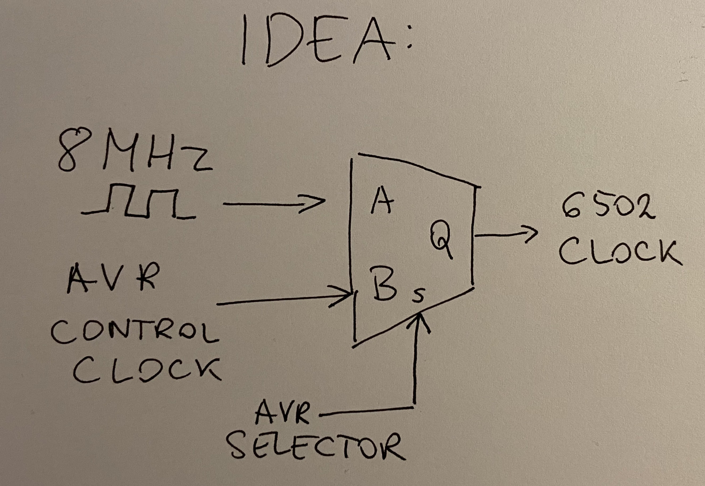

So, depending on the signal fed to S pin on the mux, 6502 would be fed with 8MHz clock or the slow AVR variant. There is, however, a serious problem with this approach:

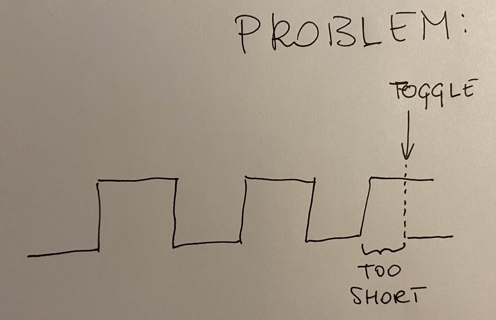

There are certain requirements in the 6502 CPU as to the length of the clock cycle. Both high and low phases of the clock need to be of certain duration. If the toggle happens in the middle of low or high phase (called PHI1 and PHI2 respectively), CPU state might get corrupted. Nothing tragic, but whatever software ran on the computer would no longer work as expected.

Probably most of the times you wouldn't even notice, because CPU would somehow recover or the data that was corrupted (like accumulator state) was not important (as it was going to be overwritten anyway in next cycle).

However, every now and then, the results would be catastrophic - execution would fail due to hard to pinpoint glitch.

The problem is that you need to find a way to ensure these things don't happen. Even if you know what to do (and probably some of you already know the solution to the issue at hand), the important questions is: **how do you know the solution will work**?

# TDD to the rescue!

Well, I'm new to electronic engineering, but I'm no stranger to software development. What developers do to ensure their mission critical code runs correctly? They apply one of many proven techniques to ensure code correctness, and one of them is Test Driven Development where you start with writing tests that your software absolutely must pass. Your tests are not based on observations of the encountered or expected failures, your tests document the critical requirements. If your software must ensure safe plane landing you don't test altimeter reading, you test for collision, and first flight ends in flames :)

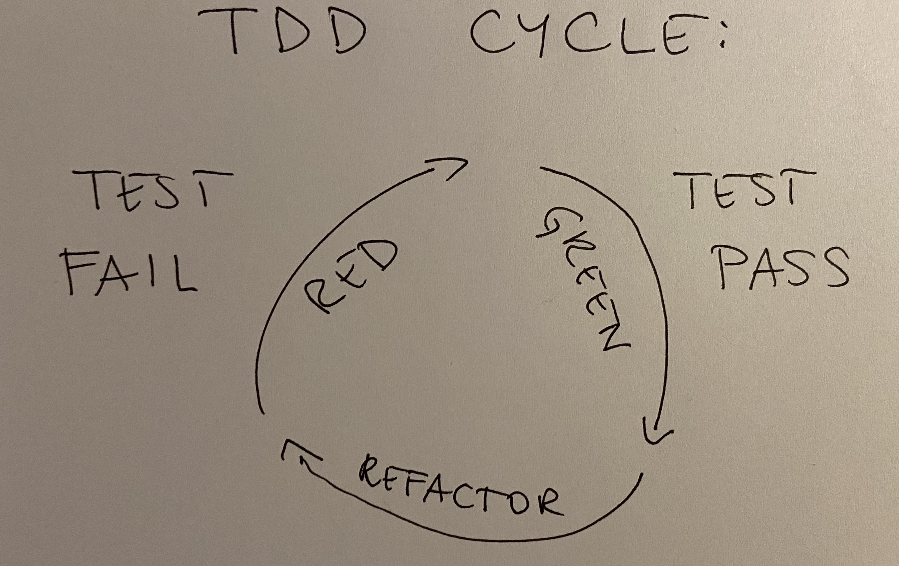

Basically, to consider TDD execution to be proper, you have to ensure to see the test fail the first time. If you wrote your code first and the test later - you are doing it wrong. If you wrote your test first, and then your code that works - you are doing it wrong. You have to see your test fail to know that the test itself works correctly. Only then, when the test finally passes you can consider the code correct.

So, how do we go about this approach with the problem at hand?

There is just one requirement here: clock cycle can't be shorter that half the maximum CPU frequency. So, if the maximum for modern 6502 is 14MHz, then neither of the clock phases can be shorter than 35ns (half of 71ns which is 1sec/14.000.000).

So, we need to generate special test fixture that will toggle clock selector in a way that ensures shorter than 35ns cycle. Then, we need to come up with a test that will catch these occurrences. And only then, when we prove we can see the test fail, we can go about finding a fix for the problem.

# Initial setup of the test fixture

Let's start with the basics: we will need a clock, say 8MHz, that will generate the basic signal:

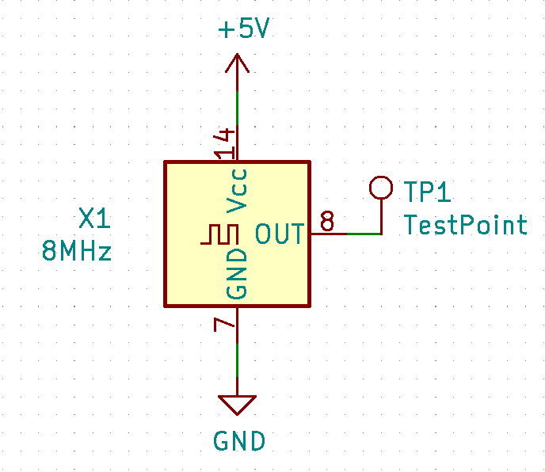

Build it on breadboard:

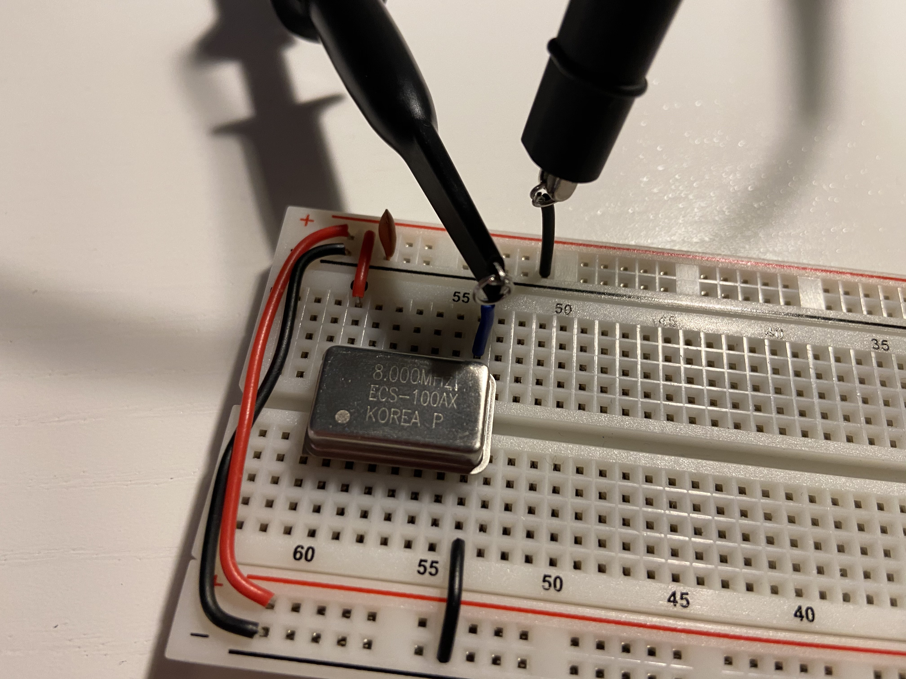

Measure to be sure:

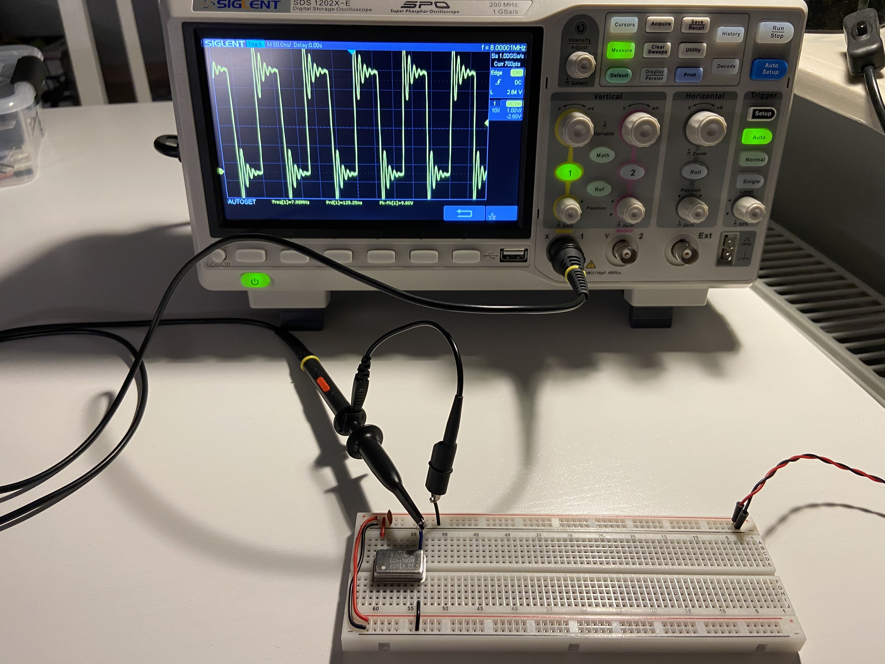

Sorry, had to show my toy again :) Close-up:

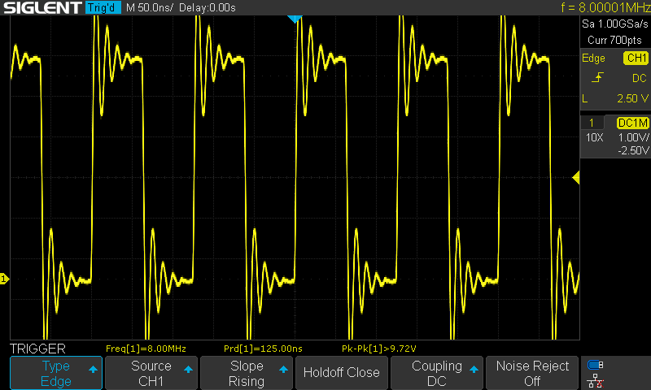

Nice, we have a clock. It's ringing like hell, because I'm too lazy to install all these springy things on my probes. Whatever :)

# Add some delay to it

Now, the clock switch will have to happen shortly after the clock cycle has started. We can use hex inverter for it:

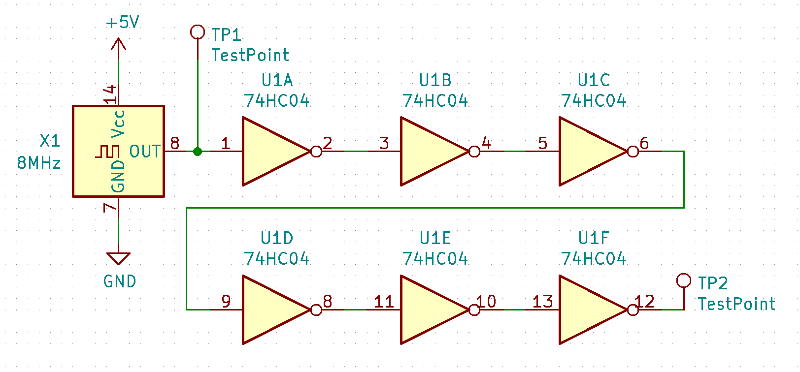

Each gate has some propagation delay to it, so when accumulated it should be pretty visible. Build on breadboard:

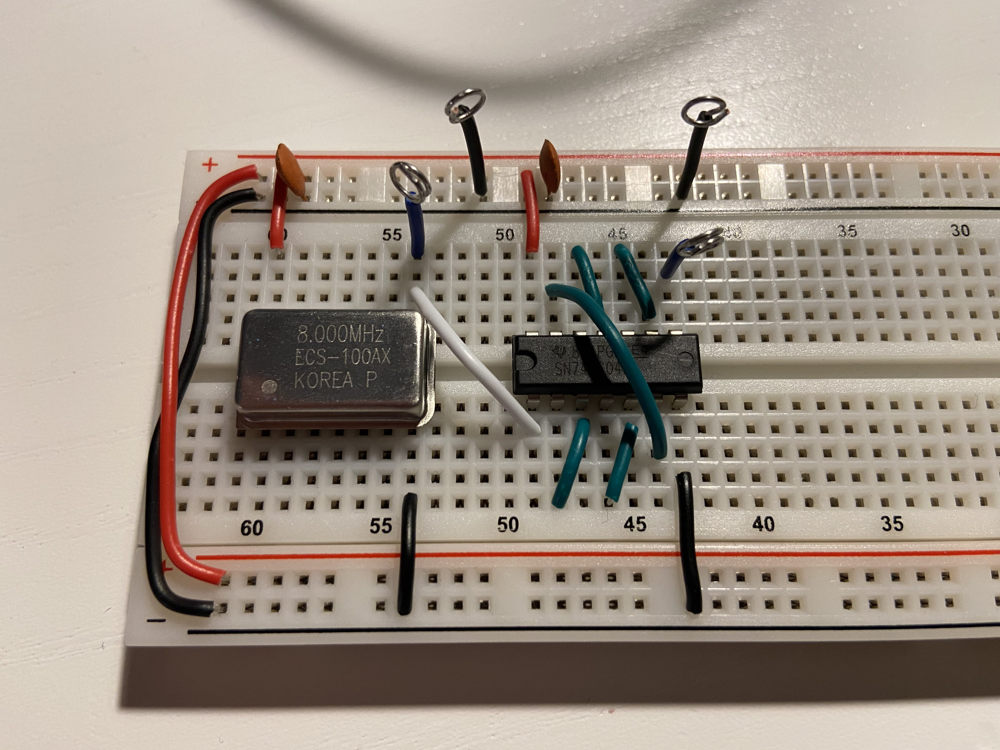

Measure to be sure:

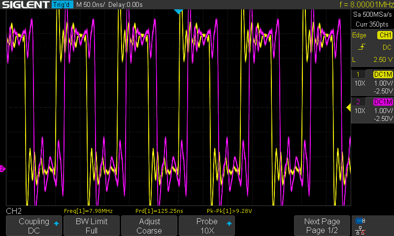

Great. We can see that the second test point registers noticeable delay.

# Clock switching

Now, since we have the alternating signal delayed to the clock, we could move on to installing the mux now (and use the pink signal as clock source selector), but this would give us only single scenario, where clock toggle always happens at the beginning of high clock cycle. We need something more varied: short cycles at both ends of the cycle.

To do that, we will switch every other cycle: sometimes at the beginning, and sometimes at the end of high clock cycle. To do this, I will use D flip-flop that would basically produce clock switch signal every two main clock cycles:

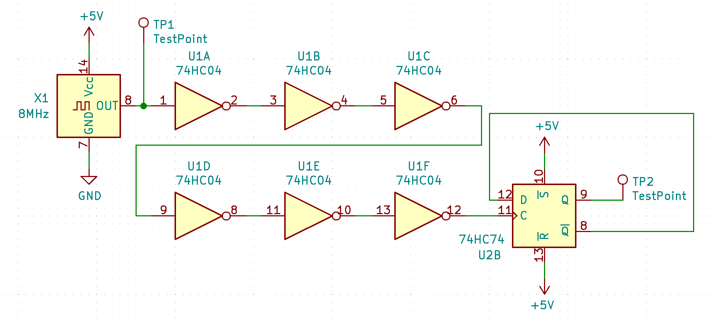

As you can see, output of the flip-flop will always change shortly after the main clock rising signal, and it will alternate each time with the last state. This is how it looks on breadboard:

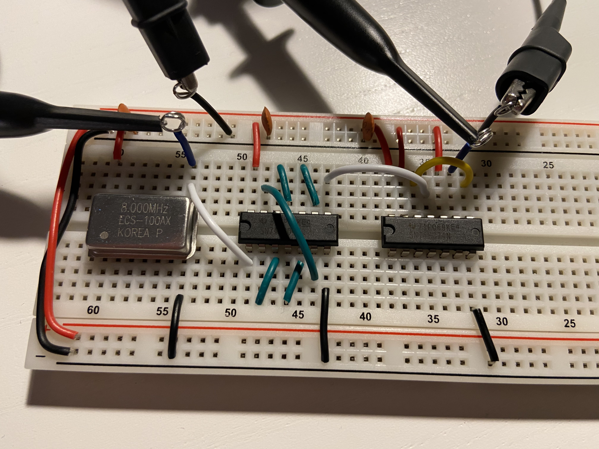

Now, when I measure the flip-flop output, I can see the following:

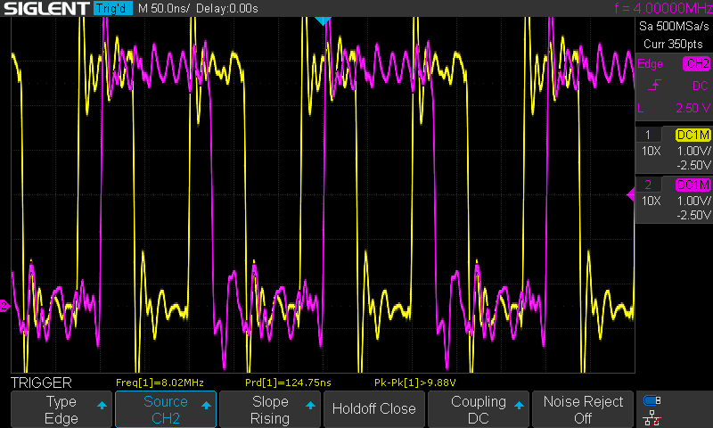

Now, let's assume that low output from the flip-flop (CH2, pink) selects main clock, while the high output selects AVR clock. Let's also assume that the AVR clock always starts low (we control its state programmatically, so we can always pull it low before the switch). Therefore I will build the mux circuit, but the AVR clock will always be low.

Looking at the diagram above you should be able to imagine how will the resulting signal look like: Wherever pink signal is high, the clock output will be low; in places where pink is low, it will copy the yellow signal. Resulting spikes will be much more narrow.

# Adding the multiplexer

So, let's see if the hypothesis holds when we add the mux:

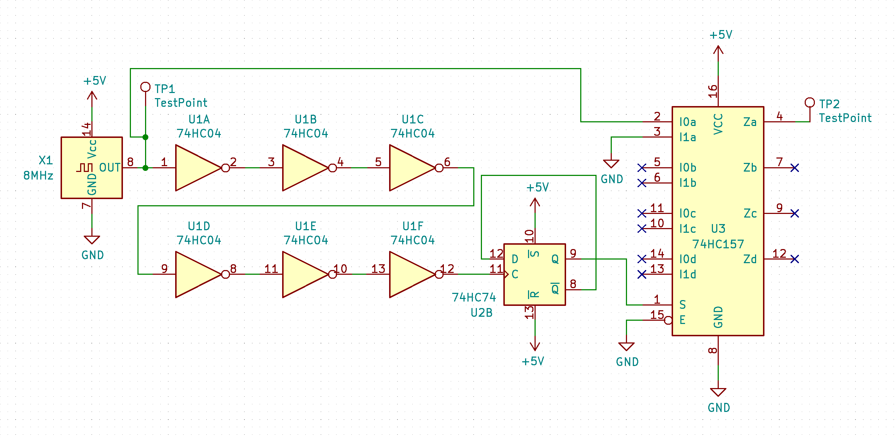

As you can see here, the output of flip-flop (pink signal on previous measurement) is driving select line of the mux. There are just two inputs: master clock on I0a, and permanent low on I1a as described above.

Breadboard build:

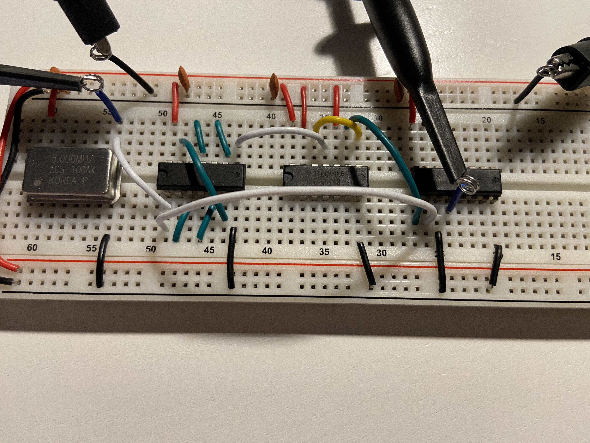

And now the fun part - the actual test case that should capture failure. We could run the oscilloscope and measure widths of the pulses to check them, and keep looking for ones that are below safe region.

There is, however, better way to do it. We can set the trigger in the scope to look for clock pulses that would be shorter than 35ns:

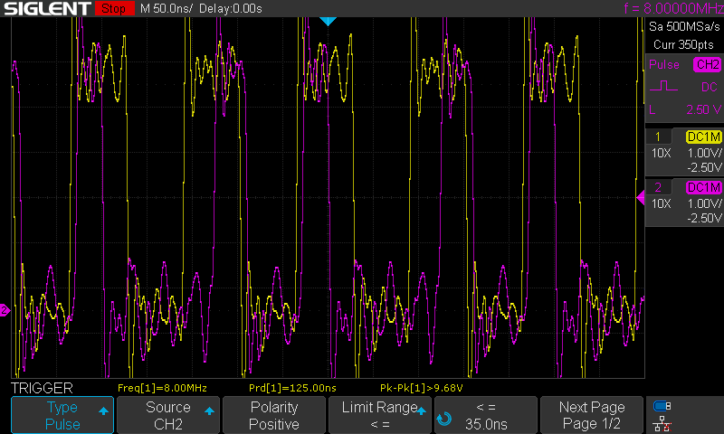

This way it doesn't matter whether the pulse is happening every time (as here), or once every million cycles - scope will stop if it is found at least once. If it runs and runs without capturing the result, it means that there are no pulses that would cause CPU failure.

As you can see above, such pulse was found immediately, as per test design.

**This is great - it means that we successfully built test fixture that produces signal that violates the CPU requirements**. We are seeing red, yay!

Now we need to find a way to change the clock source selection circuit (that currently contains only the mux, the rest is really test fixture only) so that the issue doesn't occur anymore and our test passes each time.

# Fixing the problem

Now, you probably know the solution to the problem already, and indeed it's pretty simple: we want to synchronise clock toggle operation with falling edge of the faster clock. There is very simple, standard way to do so. We just need to use the second flip-flop in the package:

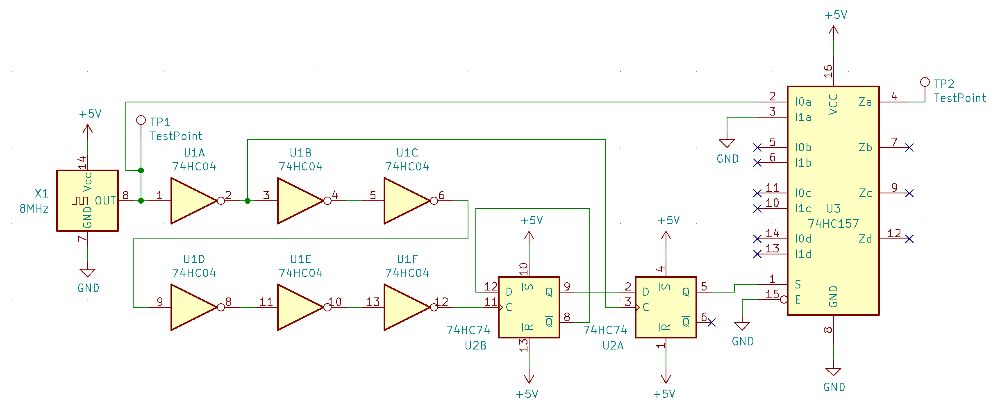

This added flip-flop will "filter" any clock toggle request signal (produced on output of the first flip-flop), letting them pass only on the negative transition of clock. Please note: that the flip-flop clock is connected to inverted master clock signal. This implementation ensures that each clock toggle operation happens exactly at the beginning of clock cycle, when the clock is low. Hopefully, that is, but we are going to test it!

This is the breadboard build of it:

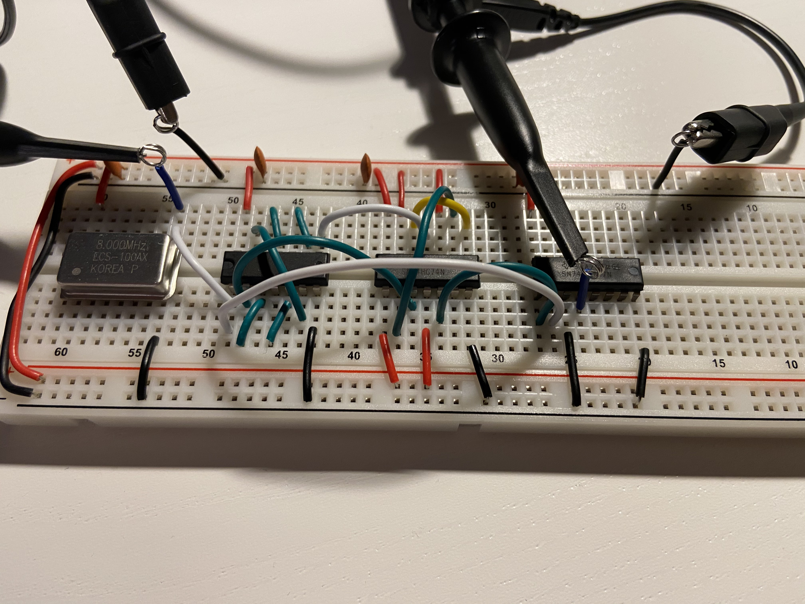

And this is how the clock signal looks on the scope:

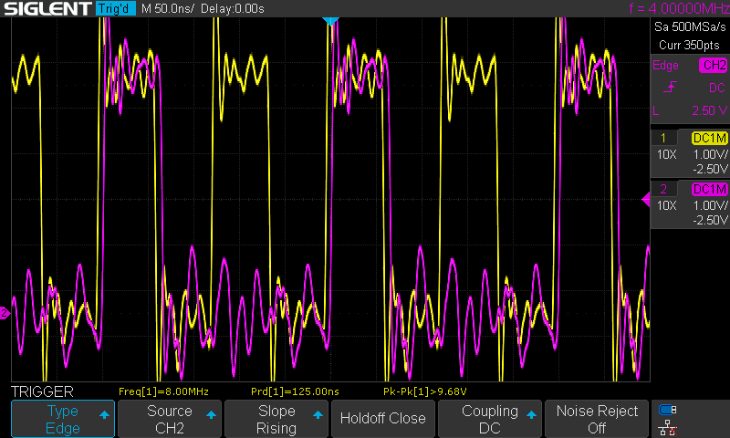

As you can see, the clock toggle operation is synchronised with master clock, even with the clock selection signal specially produced to interfere with the solution.

In auto mode we can see that the scope can't sync to expected signal, which is already good sign:

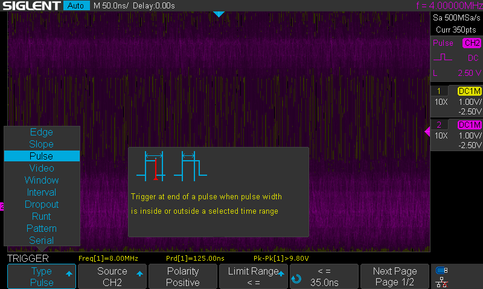

Let's try to capture single occurrence then:

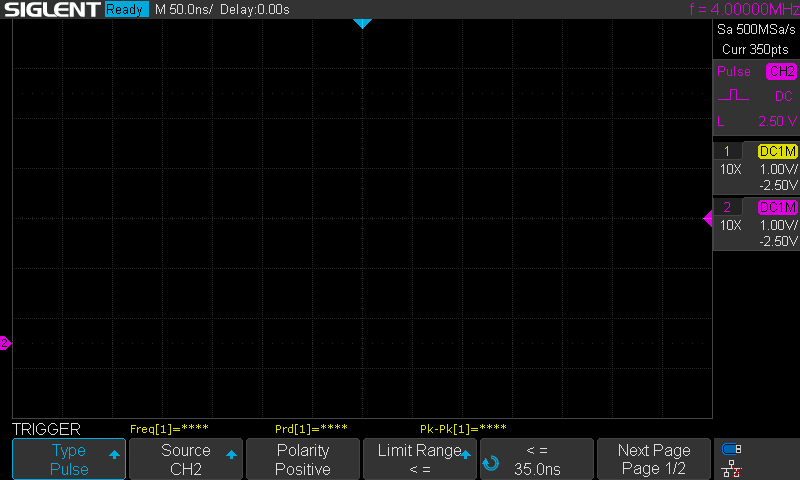

Nope, none found.

What if we increase clock pulse length?

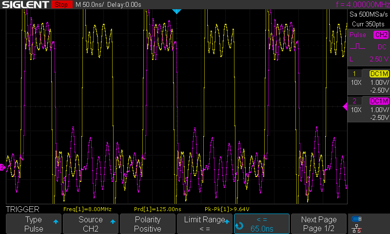

Yeah, we do have a match. This means that our test fixture is working, our test procedure is correct and our solution to expected problem is working correctly. We have successfully completed full TDD cycle and have a solution that is proven to work as per initial requirements.

Let me know what you think in the comments below, please :)

EDIT: After having received [comment on Reddit forum](https://www.reddit.com/r/beneater/comments/jexoc2/building_clean_clock_source_selection_circuit_for/g9iwu46?utm_source=share&utm_medium=web2x&context=3), I would like to add more information here. First of all, using single flip-flop can lead to serious issues caused by metastability. There is this [Wikipedia article](https://en.wikipedia.org/wiki/Metastability_(electronics)) about the issue, but I find [this explanation](http://www.asic-world.com/tidbits/metastablity.html) much better.

This means that to ensure correct clock operation, you should put the resulting clock selector signal through another flip-flop that will filter out any metastable output from the first one.

The other thing is related to synchronizing clock switch of two unrelated clock sources (case that is not really applicable to what I'm doing here), and there is very nice and clean solution for it [described here](https://www.eetimes.com/techniques-to-make-clock-switching-glitch-free/).

**As usual: the key takeaway is: share so that you can learn from others!**