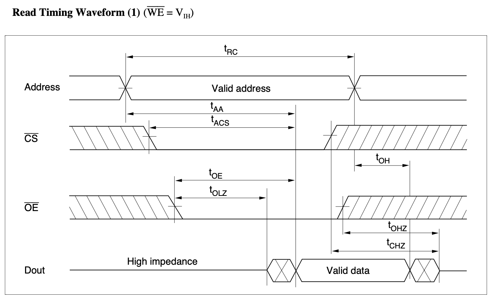
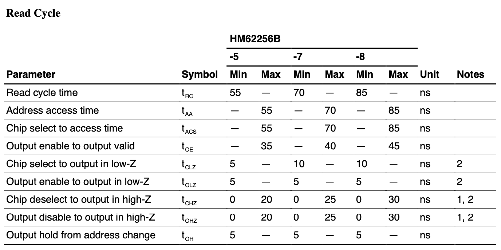
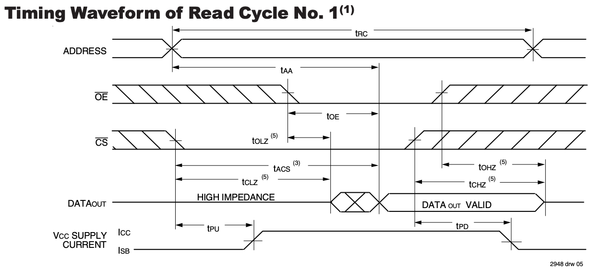
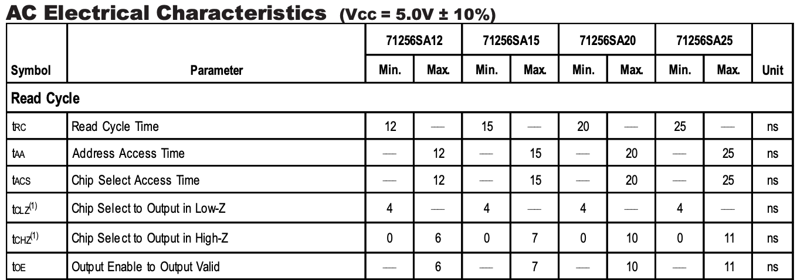
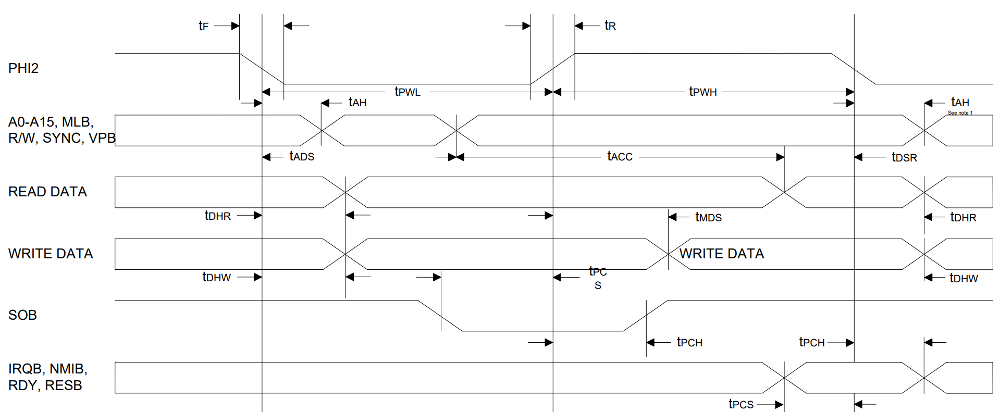
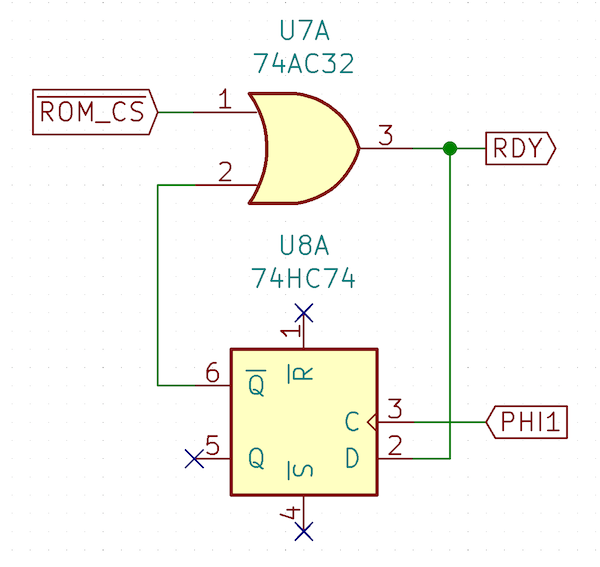
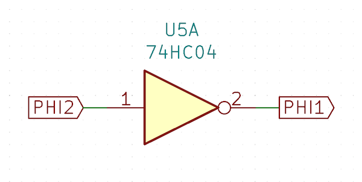
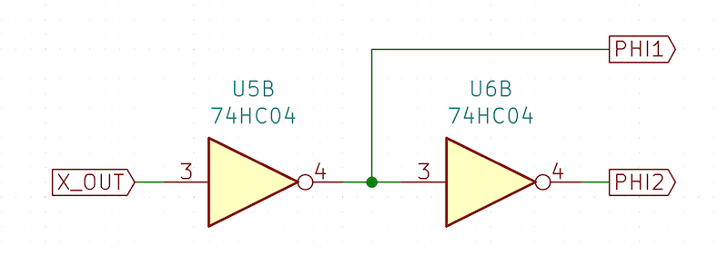
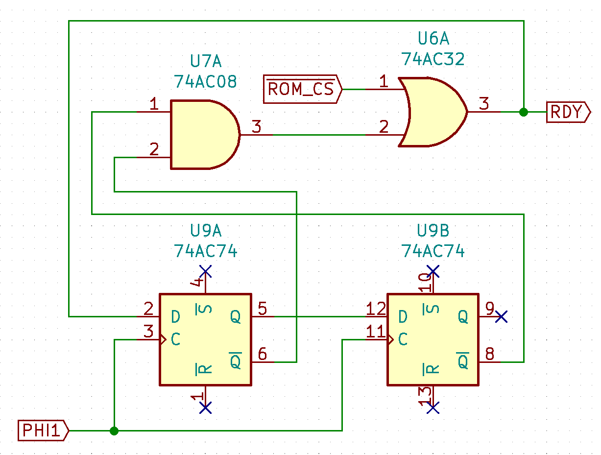

# Timing issues explained

This is the final part of the 14MHz series, but I'm sure it's not last entry about it. Sorry if it had been a bit stretched, and maybe too beginner-friendly, but I guess for all the experts out there it's all common knowledge. It's the beginners like myself that struggle with these things, so I'd rather write a bit more and make it more useful.

As I wrote in my first post on the subject, all the other issues are secondary, but the timing is the key in running 65C02 at full advertised speed. Bus translation is not very difficult, and documentation quality can be worked around with enough research (remember what that word meant before Google?), but both of these challenges are all the harder with tight timing of 14MHz.

Before we get to the point where I can talk about specifics, I would like to cover one more thing on the subject: what is the timing violation, and how can that affect your build. Again, sorry for going into such basic details, but it might not be obvious for everyone; it certainly wasn't obvious for me.

## What happens if you violate chip timing?

We have all done that at some point, and what we know for sure is that it didn't cause the universe to implode. That's already good news, but in fact: where do all these timing restrictions come from and why? Well, our digital logic integrated circuits are not as digital as we would like them to be, nor are they logical. That part I'm sure of - integration and circuitry are still up for debate :) 

What happens in a chip like a simple NAND gate is that whenever voltages change on input pins (which, by the way, is also not that very instant!), there is very long and complicated process where different components of the circuit start responding to changing input, and they all do it in very analogue and illogical way. Usually the dance of currents and voltages takes from several to several dozens of nanoseconds. Anything that happens in between is pretty much random, and as with anything random, you can never assume that your result is the proper, final one. It might, just as well, be just random value that resembles the final value closely enough.

What's even worse, this dance is not deterministic. It's not like the access will always take the same amount of time, because both internal and external conditions might change the duration of the process. This is why in datasheets you have pessimistic values for each operation, and while these are not very important at slow CPU speeds, the faster you go, the more it matters. Let's look at the NAND gate used in Ben's project:


Now, it's tempting to assume that the worst case possible scenario at room temperature should be around 15-18ns (taken from rows 4 and 7), but this assumption is valid only if you can guarantee that your operating voltage will not drop below 4.5V. Can you? Sure, we have decoupling caps for that purpose exactly, but still, keep that in mind, it might matter! If the voltage drops below 4.5V threshold, propagation delay will be longer and valid response will appear on output later. Will you notice? Not necessarily. You might be lucky to get response faster thanks to the random operation in the IC.

Still, these are pretty simple cases. When you consider more complex chips it gets even worse. More moving parts means much more unexpected behavior. It's especially interesting in case of reading ROM memory, which usually will be the slowest part of your build (unless you connect LCD directly to the bus, that is). Let's consider simple example (assuming ROM starts at 0x8000):

```
    LDA $2000
    CMP $9000
    BNE not_equal
```

As you can see, I'm reading RAM at address 0x2000 and comparing it against ROM value at 0x9000, jumping to `not_equal` label when the values differ . How much can you violate the ROM timing for the code to work? Basically, how much can you push that read beyond ROM limits before it fails?

There are two things to consider here: 

1. How random is the value in 0x2000 - basically, what values can it assume depending on the logic behind the program? If there are just two values (like 0x00 and 0xFF) then the probability you catch the error is higher, so your code is less vulnerable to timing violation. Now, if the value is fully random (it can assume any of 256 values with equal probability), the equality occurs only once in 256 tests. If the value in RAM is 0x55 (0b01010101) and the one in ROM 0xAA (0b10101010) then all you need is one bit of the ROM cell read correctly for the test to pass! Even if ROM reads as 0x54 (0b01010100), having only single bit 0 correct, then the equality test will correctly fail, and you will not notice the violation!
   So, with timing violations your results can vary between alternate possibilities with different probabilities. That's quantum computing on 8-bit 80's hardware for you!
2. You might be thinking that I'm being silly here, and my example doesn't make sense, since ROM is mostly used to store the code and any timing violations during opcode read would result in execution failure. Yes, you are correct, but sequential code execution doesn't mean that your timing is correct, because of the second issue: ROM chips are not uniform landscapes of storage cells with uniform random access time. Instead, these are organised in "pages", which are selected during read operation. This process takes pretty long time, but consecutive reads from the same page (or close to it) happen much faster. Your code is usually executed from adjacent cells in ROM making these accesses much faster and seem as if protected against timing violations. So: running the code from ROM just fine doesn't mean you got your timing right!

The reason I spend so much time describing this is that I want to make sure you understand that it's easy to see that your timing is off only if it's really, really off. Edge cases and minor violations might slip unnoticed for a long time and be very, very difficult to locate and fix. This is another reason why going from one to eight megahertz is pretty simple. Going further gets harder with each additional megahertz. If you want to go down that route make sure you know why you are doing it...

## The worst case of timing violation

This was really, I mean really infuriating. Also: this is something that I still haven't fixed yet, but hoping to be able to work on it and get it right soon. Or some day, really...

One of the things I hated about my first DB6502 build was that all the delays used arbitrary cycle counting technique. Sure, it's pretty easy and reliable (unless you have plenty of very frequent interrupts that is), but it does depend on the CPU clock. If the clock speed changes (as a result of invoking the debugger for instance), simple 20ms delay might run for minutes if not hours. Each time I wanted to test the system against higher frequency I had to replace oscillator (pretty easy thanks to the oscillator sockets which I can't recommend enough!), but also recompile OS/1 software with new clock counting ratios specific for new frequency. I hated this and wanted to solve it in my second DB6502 version.

Sure, you might think RTC will do just fine, but I came up with "better" idea. UART chip I used (SC26C92) is pretty versatile beast and it provides clock interface based on its own oscillator used for baud rate generator. This seemed as perfect solution, as the BRG clock doesn't change with the CPU clock when going into debug mode. The idea was simple: implement new version of the delay routine that would translate desired number of miliseconds to 3,6864 MHz clock ticks, kick off the UART X16 timer and poll periodically to see if the countdown is completed. Sure, I could also use IRQ for this, but wanted things simple for now. Surprisingly enough, the code worked almost the first time around. Impressed with the result (and how precise the measurements were), I have added another feature: CPU speed calculation routine - it used two clocks at the same time: one in VIA (counting CPU clock ticks) and one in UART (counting fixed 3,6864 MHz). CPU frequency could be estimated by how many clock ticks VIA counted during fixed period measured by UART. Simple, elegant solution, and it also worked beautifully.

TODO: Insert image here

Then I moved to 14MHz and strange things started happening out of a blue. The worst part was that the system would boot to shell, everything seemed fine, but during XMODEM file transfer it would fail randomly, sometimes being able to transfer one to twenty blocks of data and freezing after that. Long days of troubleshooting revealed the culprit - the UART countdown clock (used in delay routines executed during data transfer) would occassionally stop. Not the first time, not the second, but at some point in time it would just stop counting down, throwing delay routine in infinite loop.

Now, I'm not 100% positive I know the reason. I think I do, and I even managed to capture some data on my logic analyser supporting the main hypothesis. The main problem with the timer function in the UART chip is how you operate it: to start the timer, you have to read from register 0x0E and to stop it, you have to read from 0x0F. Theoretically, for the chip to register the operation, read should be no shorter than 55ns, but this is one single value valid for all operations, like reading data from inbound queues. In reality, it's actually possible that your stretched nRD signal goes high a bit too late, after the 65C02 guaranteed 10ns address hold time. It all depends on the complexity of your nRD signal stretching logic, but the result is that nRD goes high during the phase in which new address is being stabilised on the address bus - and it might happen that accidentally read happens from register 0x0F, causing the countdown to stop.

TODO: Insert image here

I do realize that it seems like a long shot, but I actually did quite a lot of testing to confirm this hypothesis - I changed the polling code in a way that it compared last value of the counter between the checks and if detected no change for five consecutive times, it signals it on dedicated line. Then I connected my logic analyser to the bus and set this specific line transition to trigger data acqusition with large "pre-trigger" buffer. What I got was exactly as expected: series of correct reads with decreasing counter values until at certain point, during UART RX IRQ processing (when range of UART registers is being read), the counter stops decrementing. Once, just once, the data on the bus actually registered 5ns long read from 0x0F at the end of some other read operation.

What is weird though, is that it happens only with high frequency clock. In theory I would expect it to happen at every possible clock frequency, since signal stretching logic delay has no dependency on the main clock. Yeah, these things are not easy...

## Actual timing analysis

So, going back to the actual build, what are the key timing requirements you have to meet? There are actually several steps to consider.

### Address decoding

You must ensure to complete chip selection process during low CPU clock phase. In case of 500ns at 1MHz it's hardly an issue, but at 14MHz this window seems to shorten to 30ns. Actually, it's much, much worse. First of all, new address doesn't start to show up on the bus for first 10ns of the cycle (tAH - address hold). After that it will take up to another 20ns before the address is fully stable, and there you go: your 30ns window is gone. In fact, this is where the maximum CPU frequency comes from - as long as we assume that the address has to be stable at the rising clock edge, that is. From what I read on [6502.org](http://6502.org), some people have successfully decided to avoid this assumption.
Let's stick to the assumption then for now. We are already 30ns into the clock cycle, and the rising clock edge is coming soon. Address are stable now, but that's not the end of story - you still haven't selected any chip for read/write operation. If you decide to stick to 74HC00, you have to assume that it will take up to 18ns for the chip selection signal for RAM/ROM to go low. Sure, most of the time it will be closer to typical 9ns time, and the actual input will stabilise faster, but as I wrote above - it's not the typical cases that you have to worry about, it's the outliers. These will crash your system.
What can you do then? There are other options. You can use 10ns max time PLD, at the expense of high power consumption. You can choose 74AC00 chip, which will have 7ns guaranteed propagation delay high to low (this is the one you want). What you should avoid at any cost is making your address decoding complex - each chip adds nanoseconds to the final calculation.
So, let's assume we have the simplest possible address decoding logic, using two NAND gates of 74AC00 chip, resulting in maximum 14ns propagation delay. This added on top of existing 30ns, you end up with 44ns total time.

### Memory access time

In order to ensure that CPU reads data from the bus correctly, you need to respect also data read setup time (tDSR), which is 10ns at 5V. This means that out of 70ns clock cycle (at 14MHz), after having spent up to 44ns to select the correct memory chip, you have only 16ns to get it to output data on the bus for the CPU to read it right (70ns - 10ns tDSR - 44ns CE = 16ns)

Sure, these are worst case scenario details, but you have to account for them. If the data is presented on the bus after 17ns, it will be probably fine, but if it goes over 20ns, it will be too late. CPU will read some bits correctly and some not, and there is nothing you can do about it anymore.

If you look at 62256 memory in DIP package, it has 55ns access time:
If you check the timing table, there is interesting hint there:
There are two timing constraints that you have to take into account - tAA and tACS of 55ns and tOE, which is shorter with 35ns duration. Now, the important hint is that you can actually spend more time on bus translation of the RD/nWR signal to nOE/nWR, because chip allows for it. Still, you need 55ns from the time the address is stabilised on the bus for the valid data to show up there.

Obviously, 55ns is way too long, so you have to choose different memory chip. There are similar chips available, also in DIP package, but with different (narrow) DIP-28 footprint: 71256. These offer much better access times, down to 12ns in 71256SA12 variant:
tAA and tACS are now 12ns long at maximum:
This guarantees that data will be correctly retrieved from RAM, but what about slower peripherals?

### Wait state propagation delay

As I wrote in my last post, one of the solutions to slow peripherals is to use wait states, in case of 6502 CPU this means using RDY pin by pulling it down when access to slower peripheral takes place. Let's look at the timing aspects of this feature.

First thing (and I wrote about it last time) is that you need to pull RDY low before falling edge of the clock (effectively - before the end of the full clock cycle), respecting the CPU Control Setup Time (tPCH):



In our case (running at 5V), it will be 10ns:


So, at 14MHz we have approximately 60ns of the clock cycle when we must decide whether CPU should wait or not. Given all the above, it seems like a lot, but there is a catch or two.

If you consider simplest possible example - using wait state on every other cycle (one wait state, one ready state, one wait state, one ready state and so on...), you could use simple 74AC74 D flip-flop. This will showcase the model nicely, but in reality it's of very little use. Your logic most likely will get more complex than that, and it will probably depend on the information about selected peripheral. This makes the window shrink rapidly - if you look back at the address decoding example, you might need up to 44ns just to get reliable, usable information whether slow ROM is selected or not, leaving you with just 16ns to process this information.

Now, the processing of this data seems simple, but it's not really. This is the simplest real life example of wait state generator:


As you can see, there is just one 74AC00 gate between chip select signal and the RDY pin. Given the propagation delay of 7ns in case of 74AC00, you are left with only 9ns to spare before your window closes. Pretty tight! Actually, there is another issue here - in this schematic it is assumed that your CS signal is active high, which is not true in case of Ben Eater's build. In his specific design you could use A15 signal directly here, and you save several ns spent on inverting the signal for active low ROM CS signal.

Unfortunately, if you are using different address decoder (like my PLD based version), you might be stuck with active low signal. In this case you should use different gate: 74AC32, like so:



Luckily this specific OR gate in the AC family has similar propagation delay of 7.5ns, so it has very little impact on the timing.


You might be wondering how comes I don't take the 74AC74 delay into account. I actually do, but it just matters less, because the output state of the flip-flop is calculated at the very beginning of the cycle, on the falling edge of the clock, so it will show up there several nanoseconds after that. What you do have to consider, however, is that you have to convert falling clock edge to a rising one, probably using inverter gate. This means that output of the 74AC74 will be delayed by the time it takes to invert clock signal.

There is one trick you might use, however, and it might become useful later on. Instead of this:



You can actually generate PHI2 from inverting PHI1, like so:



And yes, the first inverter is totally unnecessary, it's here just to illustrate the idea. This way your falling edge of the PHI2 clock will be converted to rising edge (required by edge-sensitive circuits) of PHI1 shortly before the rising edge of PHI2. This might save you couple of nanoseconds, but consider the implications carefully. In the context of 74AC74 flip-flop here it doesn't make any sense whatsoever.

So, we have 9ns to spare, we are good to go, right? Obviously not. You have to calculate how many wait states you need, and this is where another catch comes into play. Single wait state for 150ns ROM will not be enough at 14MHz! Single wait state grants you extension of the tACC of full length of single clock cycle, so about 71ns. Considering previous calculations, where in the simplest possible case, we had only 16ns to access memory, even 71ns more will not suffice. You need two wait states for ROM.



 Now, if you analyse above circuit you will notice one important thing - additional wait state here doesn't add extra delay to the wait state calculation. Sure, there is additional AND gate in the picture, but its state is determined early during clock cycle, so this specific input to the OR gate is available pretty early. ROM_CS signal comes in much later - and this is the critical path for timing analysis.